# Introduction

## Quarto 


[R Markdown](https://rmarkdown.rstudio.com/), next generation


All based on [knitr](https://cran.r-project.org/web/packages/knitr/index.html) to execute R code


> Analyze. Share. Reproduce. You have a story to tell with data—tell it with Quarto.


This course presents the integration between RStudio and quarto. All the code in the  executable code chunks are hence based in R:  

> Download R: [https://cran.r-project.org/bin/windows/base/](https://cran.r-project.org/bin/windows/base/)
>
> Download RStudio: [https://posit.co/download/rstudio-desktop/](https://posit.co/download/rstudio-desktop/)


`RMarkdown` is the integrated markup language integrated within `RStudio` is the "predecessor" of quarto.


Markup languages such as quarto, markdown, html, latex, are programming languages where formatting is handled by chunk codes, named `tags`.


| Format       | Extension |
|--------------|-----------|
| Markdown     | `.md`     |
| R Markdown   | `.Rmd`    |
| Quarto       | `.qmd`    |


:::{.panel-tabset}

## HTML

```{r}
#| out-width: 90%
#| fig-align: center
#| fig-cap: HTML editor
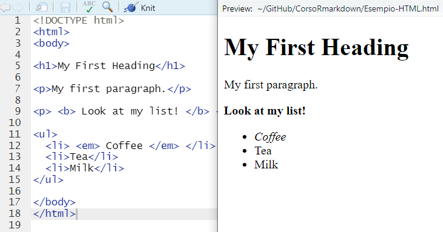
```


## LaTeX

```{r}
#| out-width: 90%
#| fig-align: center
#| fig-cap: LaTex Editor
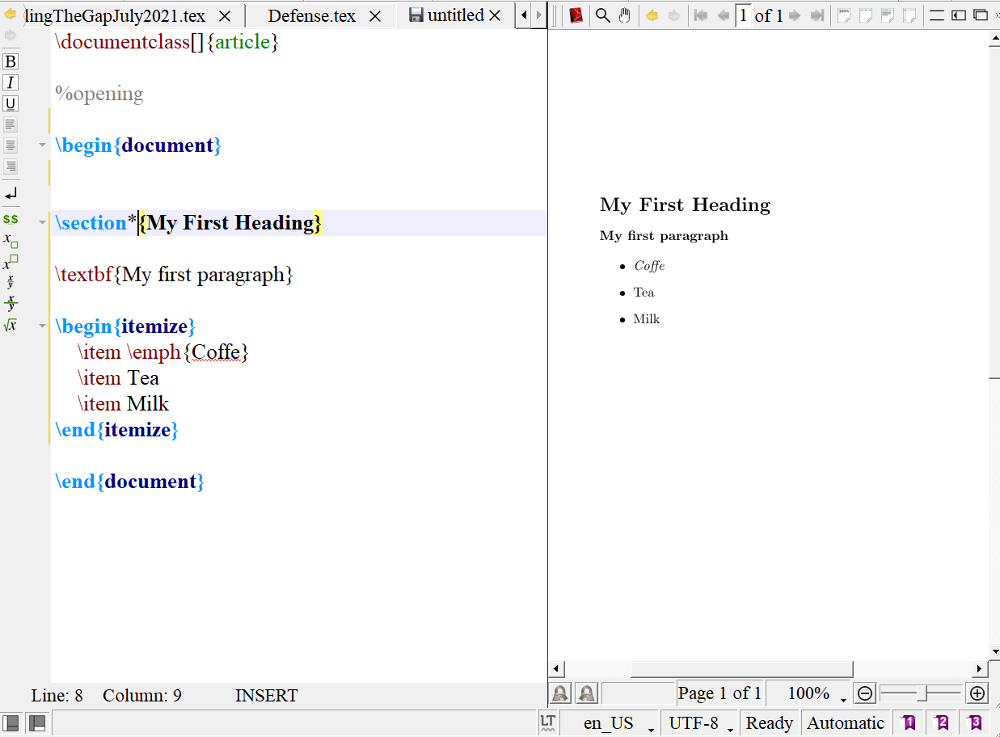
```

:::

## Markup langues vs. WYSIWYG languages

What You See Is What You Get

The text is modified with built-in command, you can see immediately the changes: 

```{r}
#| out-width: 80%
#| fig-align: center
#| fig-cap: Word
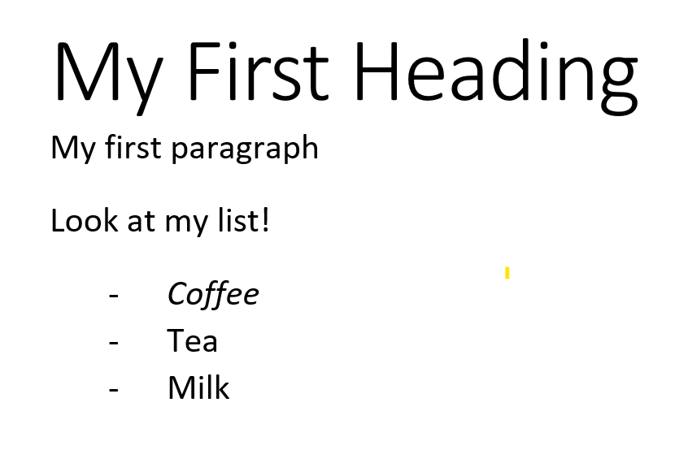
```


## Little effort, great consequences 

Using knitr, it allows for integrating analyses, text, and graphs in a single document: 

- Replicability 

- Tydiness 

- Convenience 

Create dynamic content with Python, R, Julia, and Observable

# R project 

R projects create a sort of mini-universe on you PC/Macbook so  that you do not have to worry about working directories -- just the folder of the project and the subfolders composing the project: 

```text
my-project/
│
├── index.qmd
├── data/
│   └── mydata.csv
├── img/
│   ├── logo.png
│   ├── plot.jpg
│   └── illustration.svg
├── bibliography/
│   └── references.bib
└── slides/
    ├── intro.qmd
    └── advanced-topics.qmd
```

## Create an R Project

From `File` $\rightarrow$ New Project: 

```{r}
#| label: fig-project
#| column: screen-inset-shaded
#| out-width: 50%
#| fig-align: center
#| layout-ncol: 3
#| fig-cap: Create a new R Project in 3 steps
#| fig-subcap: 
#|   - "Step 1"
#|   - "Step 2"
#|   - "Step 3"

library(knitr)
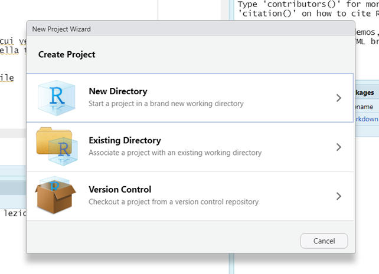
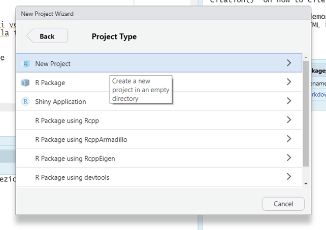
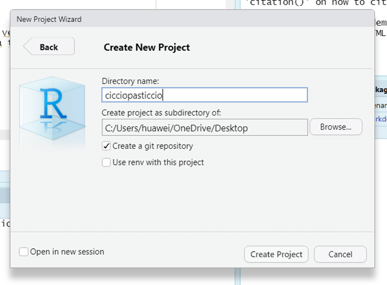
```

First (@fig-project-1), declare whether a new folder should be created (`New directory`) or not (`Existing Directory`). Then (@fig-project-2), the type of project must be selected -- for the time being, please stick with the basic project `New Project`. 
Finally (@fig-project-3), give a name to your project and make sure to tick the `Open in new session` option. 

:::{.callout-warning}
## Don't worry

The project is completely empty -- there are no subfolders nor files
:::

The working directory has been automatically set to be within the `R` project: 

```{r}
#| echo: true

getwd()
```

If you run the `dir()` function from your console (within the project), the resulting string would be empty. 

```{r}
#| fig-cap: Project folder at the very beginning
#| label: fig-folder
#| out-width: 85%
#| fig-align: center
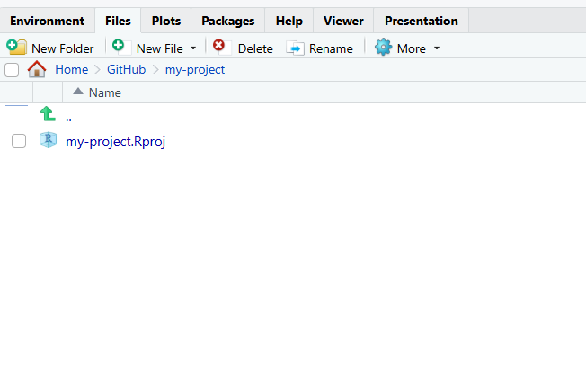
```


## Populate the project

Create the sub-folders by using the `New folder` button

```{r}
#| fig-cap: Create New Folder
#| out-width: 85%
#| fig-align: center
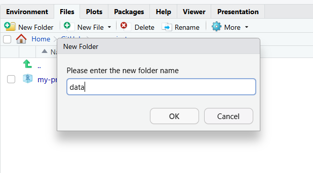
```

The location of the project folder on your computer can be easily found by using the `More` button and selecting the `Show folder in New Window` option: 

```{r}
#| fig-cap: Open Folder on your computer
#| out-width: 85%
#| fig-align: center
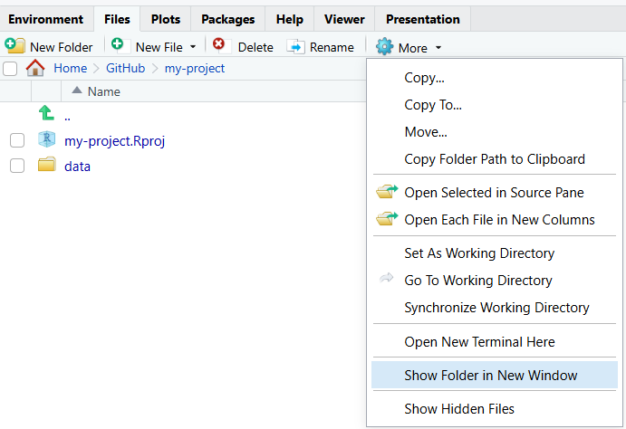
```


### Create the very first `quarto` document

```{r}
#| out-width: 100%
#| fig-align: center
#| layout-ncol: 2
#| label: fig-quarto
#| fig-cap: Create a new quarto document
#| fig-subcap: 
#|    - "Inizitialize the document"
#|    - "Speicify the type of document and some data"
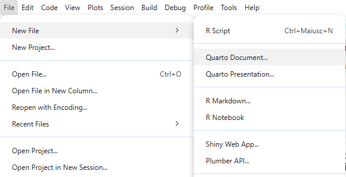
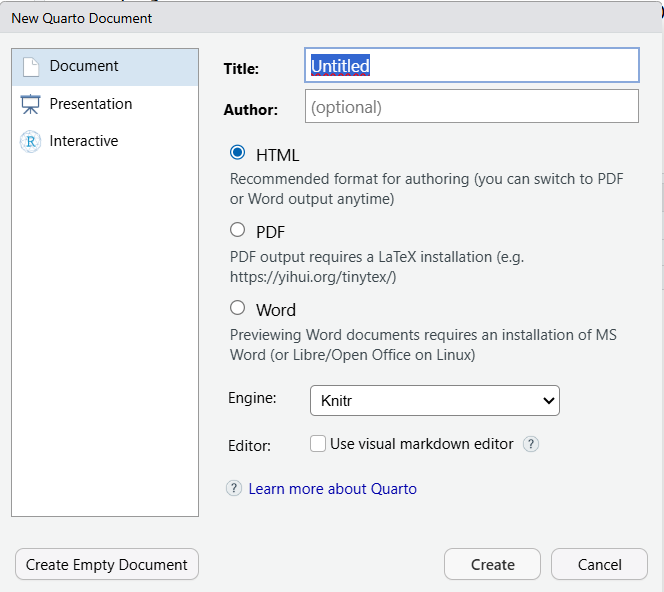
```


@fig-quarto-1 initializes the creation of a new quarto document, while in @fig-quarto-2 format of the document, as well as some of the elements that will populate the YAML (e.g., author and title) are defined. 
The default characteristics are the html document. Make sure to remove the tick from the `Use visual markdown editor` option.

#### Compile `quarto` document

The source file can be compiled and rendered in the desired format: 

```{r}
#| out-width: 100%
#| fig-align: center

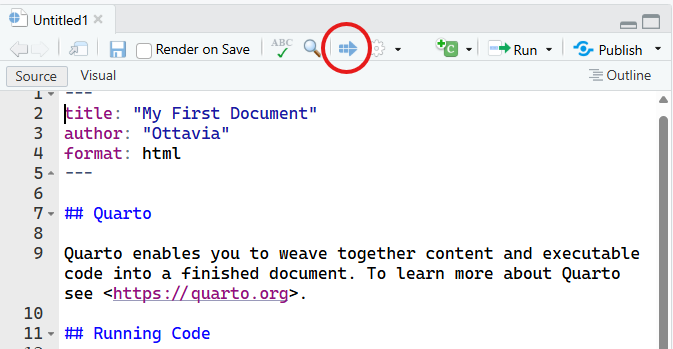
```

The file can be compiled also using the key combination

    ctrl + shift + k 


Leaving the default, the document will be compiled in HTML. 
Make sure to save the file as `index` (it will become clear later on)
