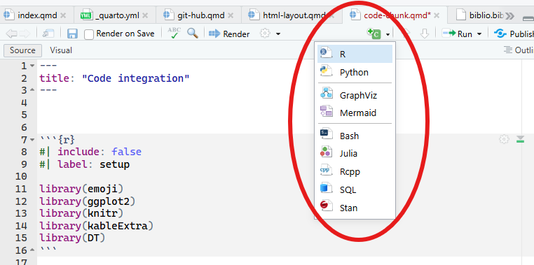
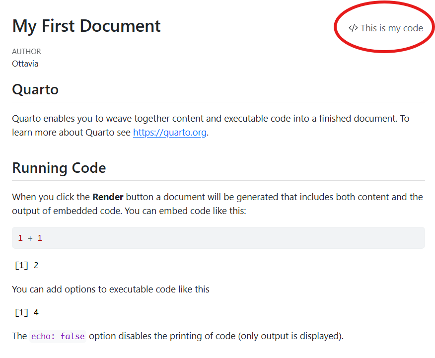
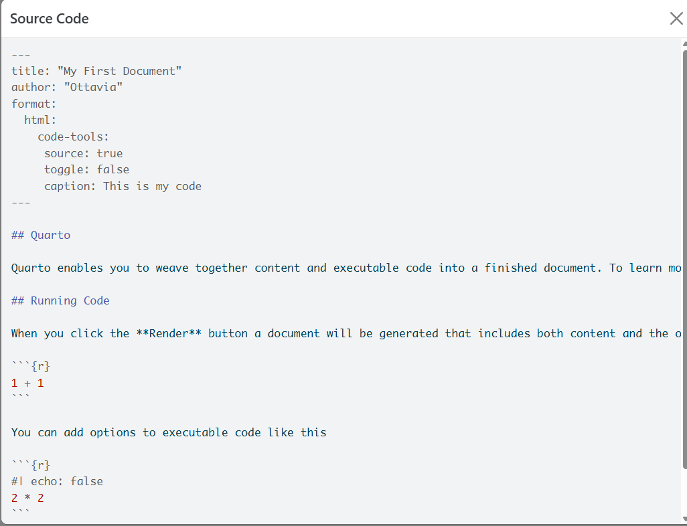

```{r}
#| include: false
#| label: setup

library(emoji)
library(ggplot2)
library(knitr)
library(kableExtra)
library(DT)
```

# Code chunks

The code chunks are the most brilliant thing about quarto (and RMarkdown): they allow for including actual code within a docuemnt and to carry out the specified analysis while the document is compiled. Long story short: This feature allows for having the report/article, table, graphs, data, and th code used to obtain all the above mentioned elements in one unique document.


The code chunk support different languages (@fig-newChunk): 

```{r}
#| label: fig-newChunk
#| fig-align: center
#| fig-cap: Open new code chunk and specifiy the language



```

A new code code chunk can be opened with the key combination: 

    shift + ctrl + i

## Chunk options {#sec-options}

Each chunk obeys to specific settings, which define the behavior of the code and of the output. 

```{{r}}
#| option1: true
#| option2: false
```


### `echo`

Controls the behavior of the code (whether it is shown and how it is shown): 


:::{.grid}

:::{.g-col-6}

**Show code and results**

```{{r}}
#| echo: true

head(cars)
```

```{r}
#| echo: true

head(cars)
```


::: 


:::{.g-col-6}

**Show only the results**

```{{r}}
#| echo: false

head(cars)
```


```{r}
head(cars)
```

::: 

:::

**Show the code, the chunk, and the results**

```{{r}}
#| echo: fenced

head(cars)
```


```{r}
#| echo: fenced

head(cars)
```

### `eval`

`echo` does not control the code execution, which is controlled by `eval`


:::{.grid}

:::{.g-col-6}

The code is executed

```{r}
#| echo: fenced
#| eval: true

head(cars)
```


::: 


:::{.g-col-6}

The code is not executed

```{r}
#| echo: fenced
#| eval: false

head(cars)
```

::: 

:::

### `results`

This argument controls the way in which the results are displayed and whether they are displayed or not. 

Differently from `eval: false` (i.e., the code is not executed, if there are errors in the code you will not notice it), `results` does not prevent the execution of the code but only the display of the code: 

```{r}
#| results: hide
#| echo: fenced

head(cars)

```


The code is executed! This ensures that there are no mistakes in the code. 

### `warning`

Controls whether the warnings associated to a code are displayed (`true`) or not (`false`): 

:::{grid}

:::{.g-grid-6}
```{r}
#| warning: true
#| echo: fenced

matrix(1:10, nrow = 3, ncol = 3)
```
:::

:::{.g-grid-6}
```{r}
#| warning: false

matrix(1:10, nrow = 3, ncol = 3)
```
:::

:::

### `error`

This argument is particularly useful when teaching, because it allows for ignoring the errors in a code and display the error message. 
If this argument is set to `false` (default) the rendering of the document is stopped when the error in the code occurs. If the error is not solved, the document cannot be compiled. 

Otherwise, if `error: true`, the error message is shown and the rendering of the document continues, regardless of the error: 

```{r}
#| error: true
x <- c(1, 2, 3)
mean(y)
```

### `include`

Super convenient as first code chunk to load all the packages, data, preprocessing. The code is executed but no messages, warnings or results are shown

# YAML control 

@sec-options presents some of the most useful options for controlling  the behavior of the code chunks for *each specific code chunk*

However, it is possible to control the overall behavior of the code chunks from  the YAML of the document with the `execute` argument: 

```{markdown}
#| echo: true
[...]
execute: 
  echo: fenced
  message: true
  error: true
```


The overall settings can be overruled by specific code-chunk options.

## Show all code

This shows the code for the entire document: 

```{markdown}
#| echo: true
#| code-line-numbers: "|4-7|"
[...]
format: 
  html:
    code-tools: 
     source: true
     toggle: false
     caption: This is my code
```

:::{.grid}
:::{.g-col-6}
```{r}
#| echo: false

```

:::

:::{.g-col-6}
```{r}
#| echo: false

```

:::

## Code fold 

The code can also be folded. Differently, only the code in the chunks is displayed. 

This can be done via the YAML (and hence is applied to ALL the code chunks in a document): 

```{markdown}
#| echo: true
[...]
execute: 
  echo: fenced
  message: true
  error: true
code-fold: true
code-summary: See this specific code
```

or for a specific code chunk

```{r}
#| code-fold: true
#| code-summary: Show this code
#| column: margin
ggplot(mtcars, aes(hp, mpg, color = factor(am))) + geom_point()
```

:::

## Code annotation

Instead of commenting the code, you can use the code annotations to make it understandable to people: 

```{r}
library(ggplot2)
ggplot(mtcars,                 # <1>
       aes(hp, mpg,            # <2>
           color = factor(am))) +  #<2>
  geom_point()    # <3>
```

1. Define the dataset to be used in ggplot
2. Define the x, y variables and the the details for the color
3. Define the type of graphical representation

```{markdown}
#| echo: true
[...]
code-annotations: below
```


* `below`: The annotation appears below the code

* `hover`: The annotation appears when the mouse hovers over the annotation marker

* `select`: The annotation appears when the annotation marker is clicked 

# Images & Graphs

## External images: `.png` and `.jpg` 

Instead of importing the images with the typical Markdown code (``), they can b@figported with the `include_graphics()` function from the `knitr` package [@knitr].


The settings for the picture can be defined by using the settings of the code chunk (these settings can also be used for the defintion of the graphic settigns, see @sec-graphs)

```{r}
#| out-width: 100%  
#| fig-align: center
#| fig-cap: A peacock living the life 
#| fig-cap-location: bottom  
#| label: fig-peacock       
#| column: margin

knitr::include_graphics("img/peacock.png")
```

| Option | Value | Description |
|--------|-------|-------------|
| `label` | `fig-peacock` | The label to be used in the cross referencing of the picture. |
| `out-width` | `100%` | The width of the picture with respect to the width of the column where the image is located. |
| `fig-align` | `center` | Figure alignment (`left`, `center`, or `right`). |
| `fig-cap` | `A peacock living the life` | The caption. |
| `fig-cap-location` | `bottom` | The location of the caption with respect to the picture (`top` or `margin`). |
| `column` | `margin` | The location of the picture. |

To cross reference the peacock picture in text (@fig-peacock), the usal cross referencing applies `@fig-peacock`.

## Graphics {#sec-graphs}

The same principles apply, but this time the picture is not imported from an external file but results from the graphs resulting from the analysis. Again the cross-referencing can be obtained as usual using the `label` defined for the graph. For cross-referencing the plot in @fig-mtcars, `fig-mtcars`.


```{r}
#| label: fig-mtcars
#| out-width: 80%
#| fig-align: center
#| fig-cap: A graph from `mtcars`
#| fig-cap-location: margin
ggplot(mtcars,
       aes(hp, mpg, color = factor(am))) +
  geom_point() +
  geom_smooth(formula = y ~ x, method = "loess") +
  theme(legend.position = 'bottom')
```

## Multiple plots with subcaption

In this case, it is fundamental to define the `label`, otherwise the subcaption will not appear. 

The subplots can be organized in either columns or rows (or a combination fo the two):

| Option | Value | Description |
|--------|-------|-------------|
| `layout-ncol:` | `3` | The space is divided into columns (3, in this case) |
| `layout-nrow` |  | The space is divided into rows (not used in this example) |.

The cross referencing of the picture (@fig-distribution) works as usual (`@fig-distribution`). Also the sub picture can be cross referenced, so that we can say what is depicted specifically @fig-distribution-1, @fig-distribution-2, @fig-distribution-3 (`@fig-distribution-1`, `@fig-distribution-2`, `@fig-distribution-3`).

```{r}
#| label: fig-distribution
#| layout-ncol: 3
#| fig-cap: Standarzied Normal Distribution
#| fig-subcap: 
#|   - "Density"
#|   - "Cumulative"
#|   - "Quantile"
x = seq(-3,3, length.out= 1000)
d = data.frame(x = x, 
               dx = dnorm(x), 
               px = pnorm(x), 
               qx = qnorm(pnorm(x)))
plot(d$x, d$dx, type = "l", lwd = 2, cex = 2, xlab = "x", ylab = "dx")
plot(d$x, d$px, type = "l", lwd = 2, cex = 2, xlab = "x", ylab = "px")
plot(d$px, d$qx, type = "l", lwd = 2, cex = 2, xlab = "px", ylab = "qx")
```


# Tables

Tables can be added with the `kable()` function (included in the `knitr`) package. This function is compatible with the customization settings provided by the functions in the `kableExtra` package [@KB]. Additionally, package `DT` [@DT] provides nice tools for producing tables.

The root for cross referencing the tables is `tbl-`. 


```{r}
#| echo: true
#| label: tbl-mtcars
#| tbl-cap: This is a table
kable(head(mtcars))  
```

# Combine outputs

It is possible to combine multiple outputs from the same code chunk: 

```{r}
#| fig-column: margin
#| tbl-cap: This is a table
#| fig-cap: A graphics representation of the dataset 
#| out-width: 100%
kable(head(mtcars))  

ggplot(mtcars, aes(hp, mpg, color = factor(am))) + geom_point()
```

# Cross referencing 

Code chunks can be cross referenced as well, the root for the cross referencing is `lst` (stands for listings): 

```{r}
#| lst-label: lst-basicPlot
#| lst-cap: Basic use of the plot() function

plot(cars)
```

And it can be called from the text as usual `@lst-basicPlot` (@lst-basicPlot). 

