```{r include=FALSE}
library(knitr)
```


# Create a GitHub account

Go to the GitHub website, available at <https://github.com/>


```{r}
#| out-width: 90%
#| fig-align: center
#| fig-cap: GitHub landing page 

```


```{r}
#| out-width: 90%
#| fig-align: center
#| fig-cap: Enter your email
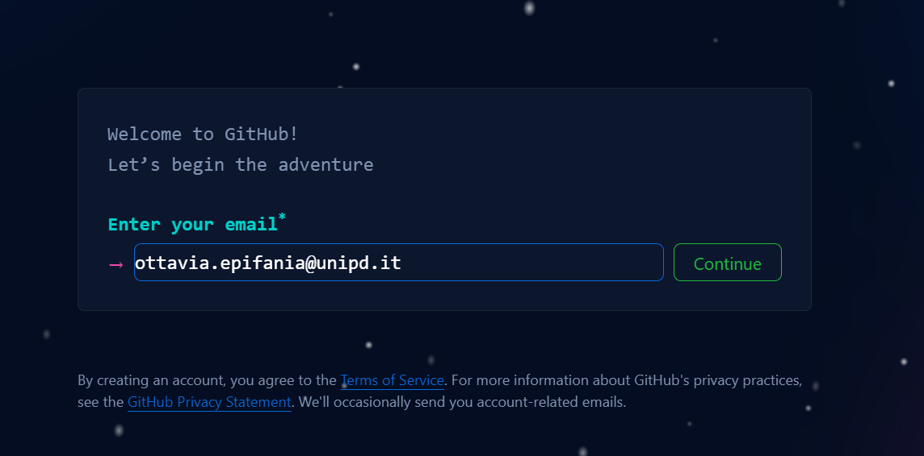
```


```{r}
#| out-width: 90%
#| fig-align: center
#| fig-cap: Set your username and password (Please choose something that you can remember)
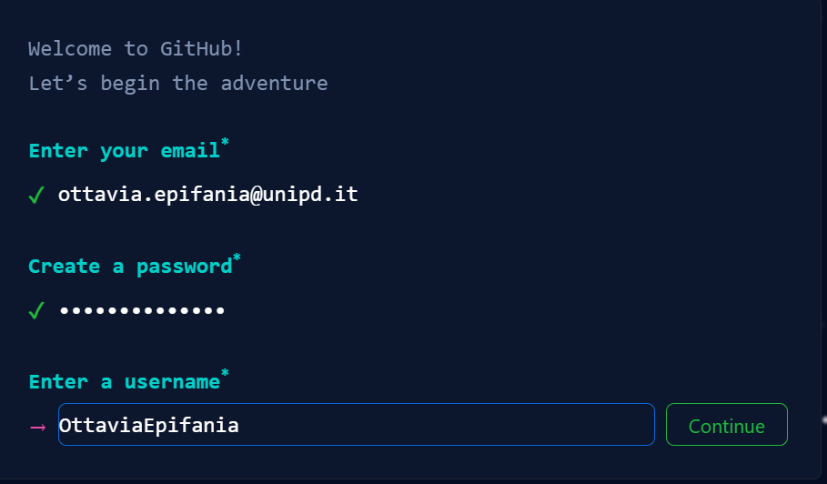
```


Solve the CAPTCHA and submit

# Install GitHub Desktop


<https://desktop.github.com/>


```{r}
#| fig-align: center
#| fig-cap: GitHub desktop landing page
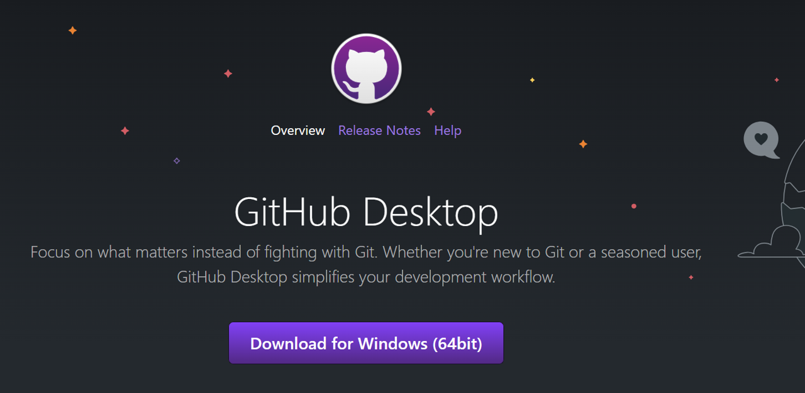
```

Once the installer is downloaded, follow the installation instruction. 
Sign in to your GitHub account

# Repositories managment

The GitHub repositories are the folders containing the R Project: 


## Create new repository

```{r}
#| fig-align: center
#| fig-cap: Create a new repository that does not exist 
#| fig-cap-location: top
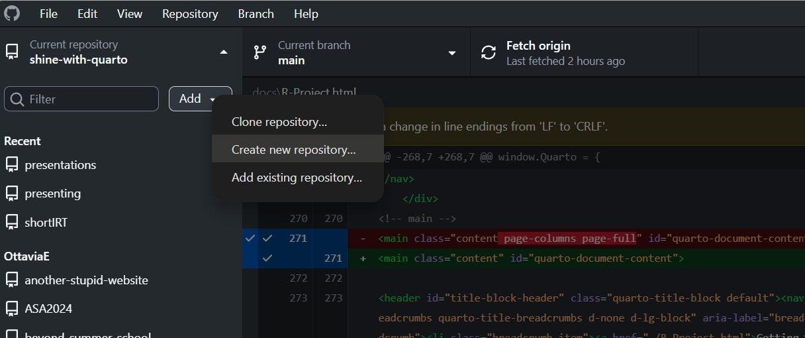
```

This initializes a new GitHub repository, where you can provide different information concerning its characteristics

```{r}
#| fig-align: center
#| fig-cap: Create a new repository that does exist 
#| fig-cap-location: top
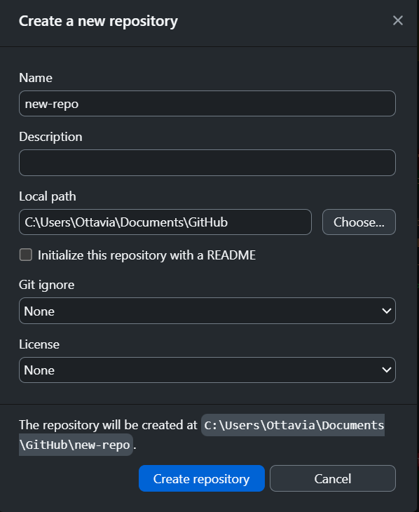
```


## Add existing repository 


```{r}
#| fig-align: center
#| fig-cap: Add an existing repository that does exist
#| fig-cap-location: top
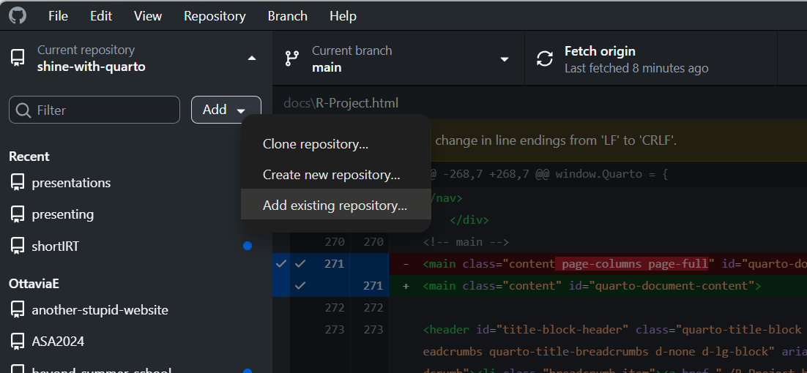
```

## Publish the repositories

Once a repository is added (either by adding an existing one or creating a new one), it can be published and made available online for other people: 

```{r}
#| fig-align: center
#| fig-cap: Publish button
#| fig-cap-location: top
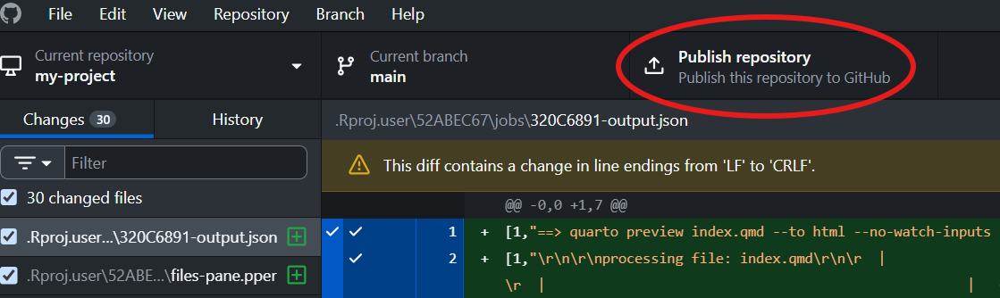
```

If you want your repository to be found by other users, remove the flag from the "Keep this code private":

```{r}
#| fig-align: center
#| fig-cap: Define the publication policies
#| fig-cap-location: top
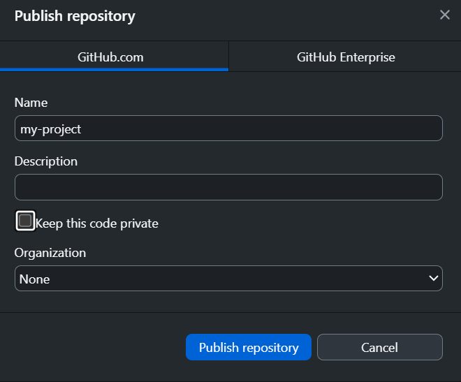
```

### `commit + push`

Everything is ready for the commitment.

1. Select specific files and commit them. The commit message is mandatory! It is useful for your future self, just to remember the changes you made, when and possibly why.

```{r}
#| fig-align: center
#| fig-cap: Select & Commit
#| fig-cap-location: top
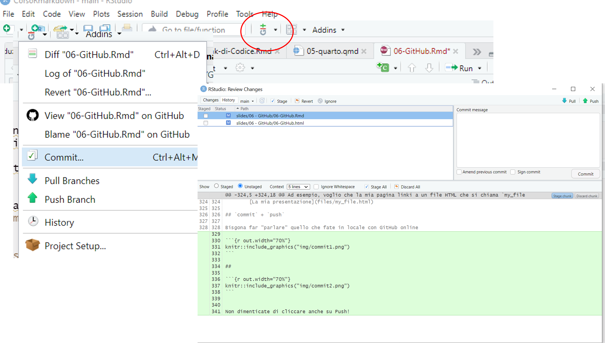
```

2. The changes must be pushed to GitHub: 

```{r}
#| fig-align: center
#| fig-cap: Select & Commit
#| fig-cap-location: top
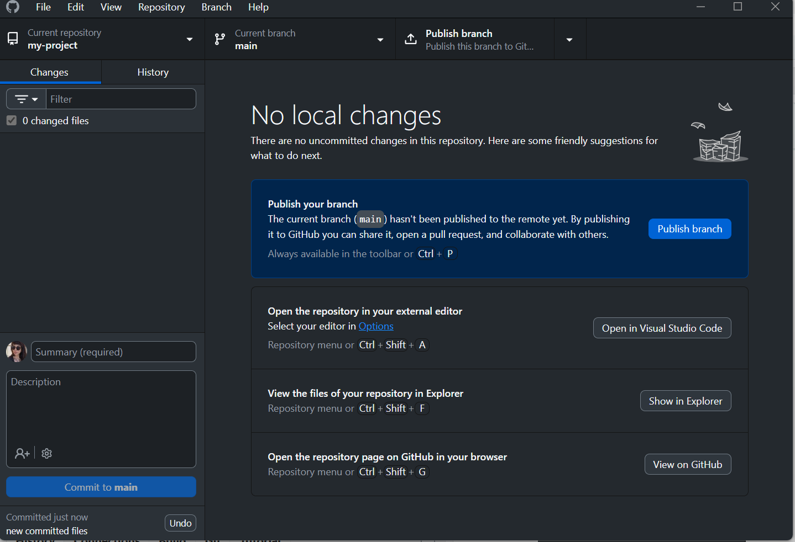
```

3. Check whether the changes are live on GitHub: 

```{r}
#| fig-align: center
#| fig-cap: Check Commit
#| fig-cap-location: top
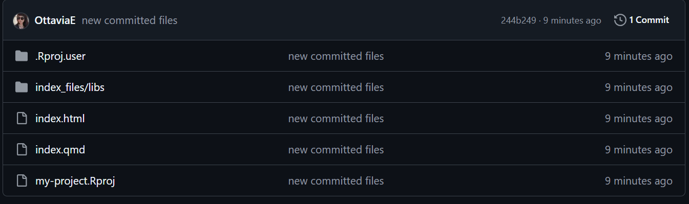
```


### Licenses

:::{.callout-tip icon=false collapse=true}
## MIT

Anyone can use, modify, distribute, and  commercialize the software, provided that the original copyright notice and license text are included
:::

:::{.callout-tip icon=false collapse=true}
## GNU

Anyone can use, modify, and distribute the software. Any derivative work or redistributed version must be released under the same GPL license and with source code available.
:::

Summarizing the differences between the types of licences:

| MIT                                 | GNU GPL                                             |
| ----------------------------------- | --------------------------------------------------- |
| Can be used in proprietary software | Derivative works must remain open source            |
| Minimal restrictions                | Requires source code disclosure upon redistribution |
| Maximizes flexibility and adoption  | Ensures openness is preserved                       |


# GitHub pages

The code is shared online, but it cannot be seen as a document, but only as a raw html code. 

GitHub pages allows for hosting personal websites on the personal GitHub profiles, such as the html documents are rendered as document and not as code. 

Each repository can be set to host the GitHub pages by opening the settings page of the repository and navigating to the Pages section: 


```{r}
#| fig-align: center
#| fig-cap: GitHub pages settings
#| fig-cap-location: top
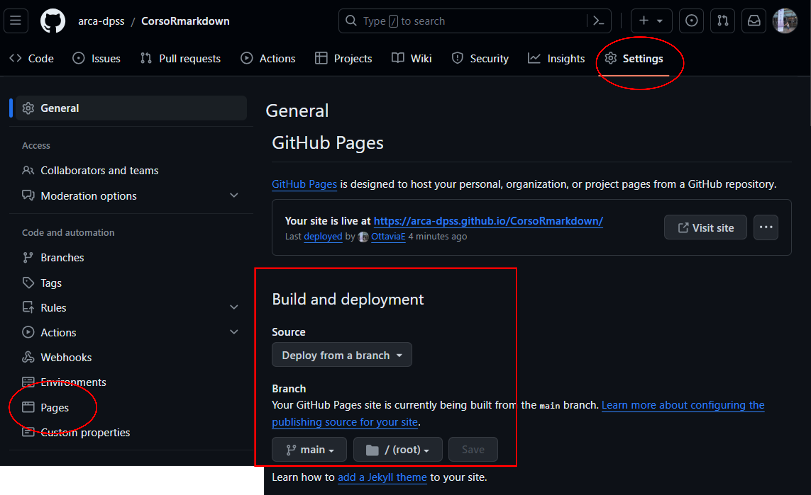
```
The main setting for the GitHub pages regards the deployment. 

The `main` branch must be selected, and make sure that the folder for the deployment is set to `root`. 

This is to check whether the pages are actually active:

```{r}
#| fig-align: center
#| fig-cap: GitHub pages is on!
#| fig-subcap: Instead of the green tick, you might see a yellow dot. It works as well!
#| fig-cap-location: top
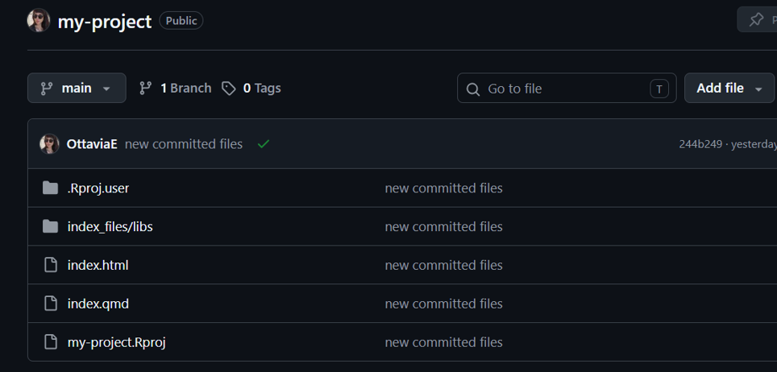
```

To transform your pages in an actual website, you need a functioning url: 

::: {.grid}

::: {.g-col-6}

```{r}
#| fig-align: center
#| fig-cap: The red circle indicates the settings to be changed. The green rectangle indicates that the GitHub pages are online
#| fig-cap-location: top
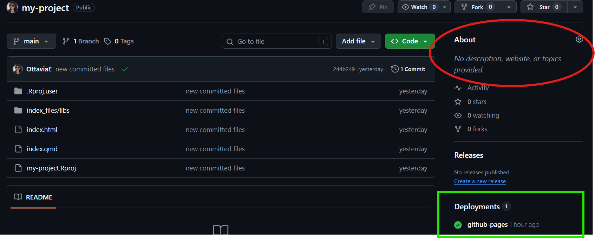
```


:::

::: {.g-col-6}

```{r}
#| fig-align: center
#| fig-cap: Flag the option for setting the GitHub pages as default website option
#| fig-cap-location: top
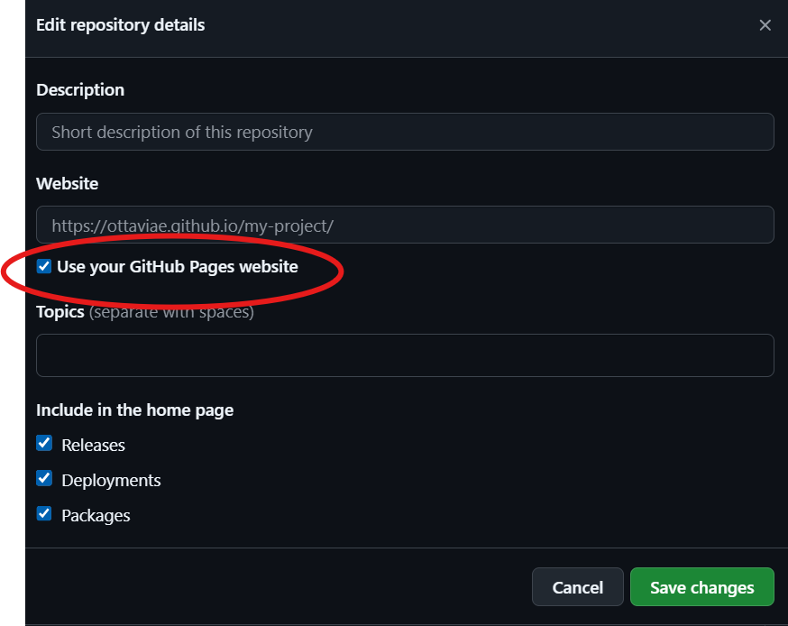
```


:::

:::

Now you have a working website! 

As you can see, the `index` file has been taken as the default landing page of your website (@fig-index). 

```{r}
#| fig-align: center
#| fig-cap: Running website with default index page
#| fig-cap-location: top
#| label: fig-index
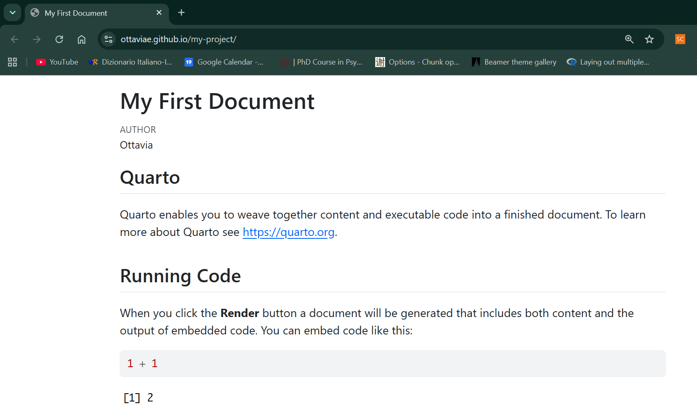
```

This means that whatever changes you do in you `index` file, they will be reflected on your website landing page **if and only if** you commit & push the local changes to GitHub, following the flow

```{mermaid}
flowchart TD

    A[Edit index.qmd]
    B[Render Quarto Project]
    C{Render successful?}
    D[Fix errors]
    E[Review website locally]
    F[Open GitHub Desktop]
    G[Review changes]
    H[Commit changes]
    I[Push to GitHub]
    J[Repository updated]
    K[Website updated]

    A --> B
    B --> C

    C -->|No| D
    D --> B

    C -->|Yes| E
    E --> F
    F --> G
    G --> H
    H --> I
    I --> J
    J --> K
```

This flow applies to any document you modify locally. In other words, to see the changes that you do locally online, you have to commit them and push them through GitHub Desktop.


