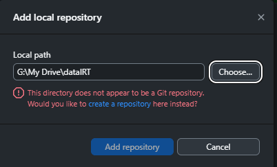
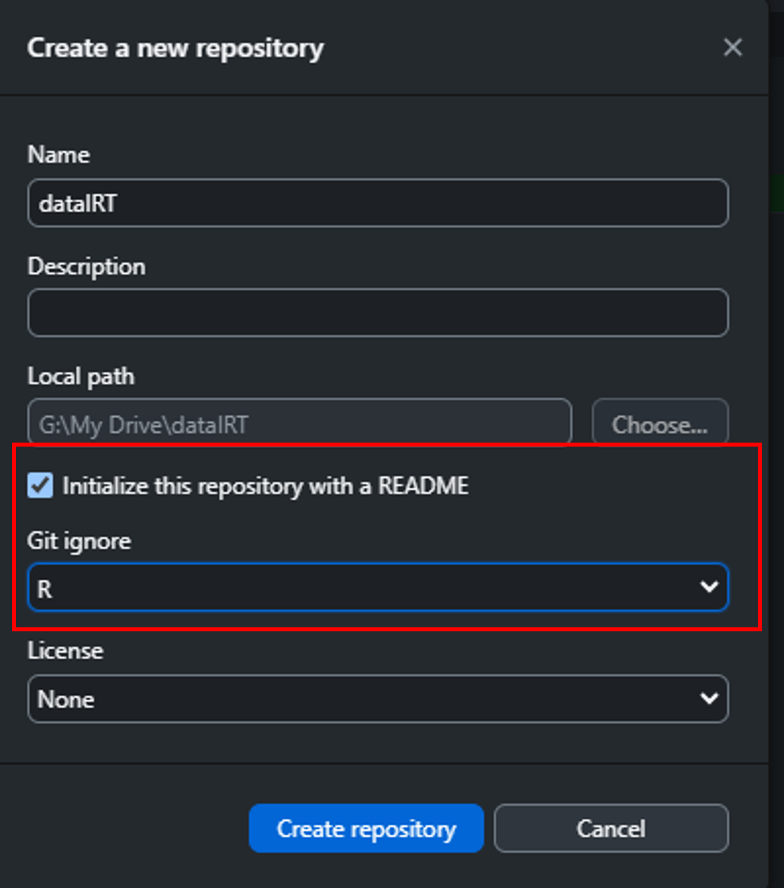
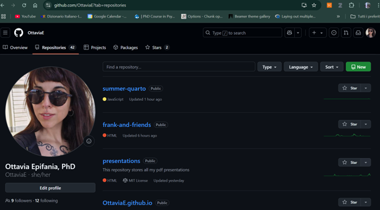
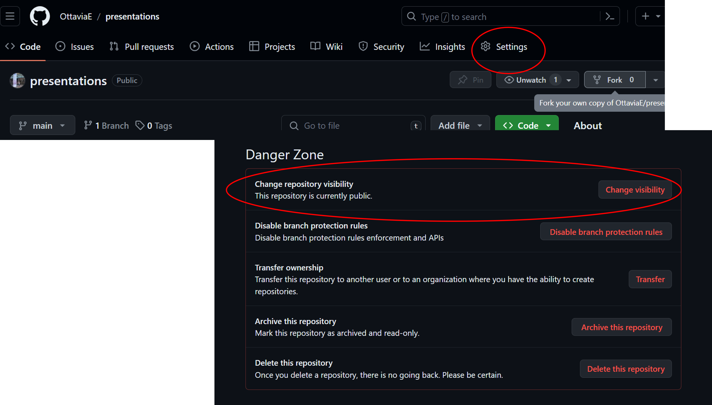

# Create a GitHub account

Go to the GitHub website, available at <https://github.com/>


```{r}
#| out-width: 90%
#| fig-align: center
#| fig-cap: GitHub landing page 
knitr::include_graphics("img/ghMail.png")
```


```{r}
#| out-width: 90%
#| fig-align: center
#| fig-cap: Enter your email
knitr::include_graphics("img/ghMail1.png")
```


```{r}
#| out-width: 90%
#| fig-align: center
#| fig-cap: Set your username and password (Please choose something that you can remember)
knitr::include_graphics("img/ghMailpwd.png")
```


Solve the CAPTCHA and submit

# Install GitHub Desktop


<https://desktop.github.com/>


```{r}
#| fig-align: center
#| fig-cap: GitHub desktop landing page
knitr::include_graphics("img/ghDesk.png")
```

Once the installer is download, follow the installation instruction. 
Sign in to your GitHub account

# Create a repository 

The GitHub repositories are the folders containing the R Project: 

::::{.columns}
:::{.column}

:::

::::

## "Clone" an existing repository I 

From GitHub desktop: 

**Add Local Repository** $\rightarrow$ search for the directory of the R project to publish on GitHub

```{r out.width="80%"}

```


## "Clone" an existing repository II

Option: **create a repository** 

```{r}
#| fig-align: center

```


Flag the option "Initialize the repository with a `README`

## Did it work? 

Navigate to you GitHub profile on [https://github.com/](https://github.com/) and to your repositories: 

```{r}
#| fig-align: center

```


## The repository must be public

```{r out.width="90%"}

```

