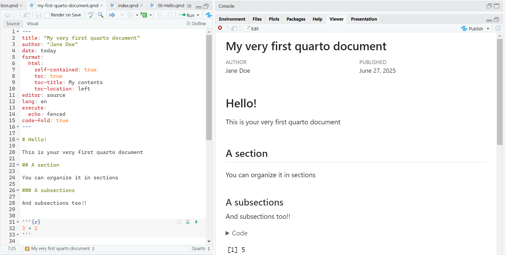
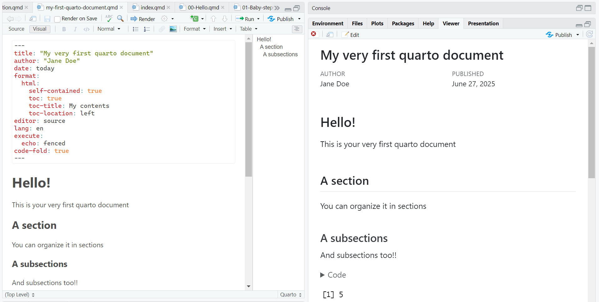
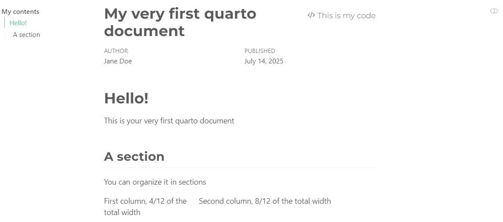
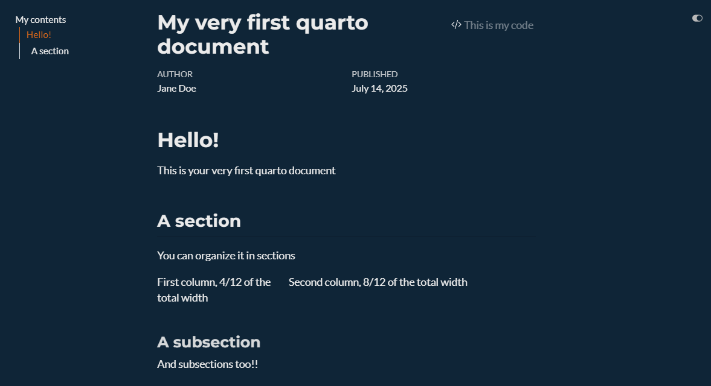
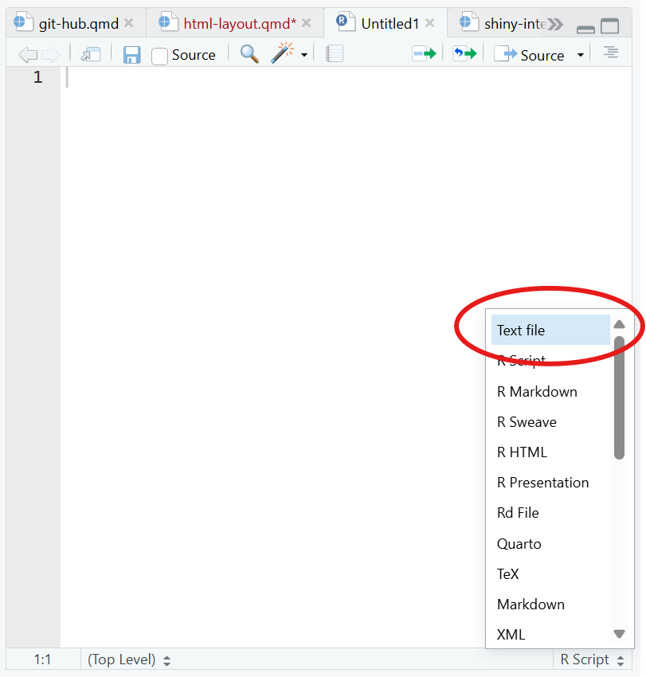

# YAML 

The overall appearance and behavior of the document is specified in the YAML. 

Importantly the YAML defines the extension of the file rendering:

::: {.callout-note}

## HTML default YAML

````
---
title: "Untitled"
format: html
editor: visual
---
````
:::


::: {.callout-note}

## PDF default YAML

````
---
title: "Untitled"
format: pdf
editor: visual
---
````
:::

## `editor`

Quarto (as well as as RMarkdown) allows for visualizing the text editor as a WYSIWYG text editor:

::: {.grid}

::: {.g-col-6}

## `editor: source`

```{r}

```


:::


::: {.g-col-6}
## `editor: visual`

```{r}

```

:::

:::

:::{.callout-caution collapse=true}
## Warning 

Although at the very beginning, the use of the visual editor might be tempting, don't indulge! Using the source editor is an investiment in your future programming skills :)

:::


## `toc`

**T**able **O**f **C**contents: Defines the index of your document and its associated characteristics (e.g., where it is located):


```{markdown}
#| echo: true
---
title: "My quarto file"
author: "Jane Doe"
date: today
format: 
  html:
    toc: true                
    toc-title: My contents   
    toc-location: left       
---
```

Be mindful of the indentation!! With the wrong indentation, the YAML breaks down and the document will not compile.

* `toc: true`: Set the table of contents                 
* `toc-title: My contents`: Define the title of the toc

* `toc-location: left`: Define the position of the toc (options: `left`, `right`, `body`)   

## Themes

The default theme of the document can be modified with the predefined [themes](https://quarto.org/docs/output-formats/html-themes.html)

```{markdown}
#| echo: true
---
title: "My quarto file"
author: "Jane Doe"
date: today
format: 
  html:
    toc: true                   
    toc-title: My contents   
    toc-location: left
    theme: superhero  
    fontsize: 32px    
lang: it                     
---
```

The theme can be defined with the `theme: specific_theme` in the YAML. Further customization can be brought with other YAML arguments (e.g.,`fontsize`) or with specific `css` settings

The theme can adapt to specific settings, such as whether you want both ligth and dark theme: 


```{markdown}
#| echo: true
---
format: 
  html:
    theme:
     light: minty
     dark: superhero
---
```


::: {.grid}

::: {.g-col-6}
## Day 

```{r}
#| fig-align: center
#| out-width: 100%


```

:::

::: {.g-col-6}

## Night

```{r}
#| fig-align: center
#| out-width: 100%


```
:::

:::

## `lang` {#sec-lang}

Set the language for your document. This is not the autocorrect! 

It sets the language to be used in the cross-referencing of your document (see @sec-cross). 


:::: [.columns]

::: {.column width="48%"}
| Language    | Code |
|-------------|------|
| English     | `en`   |
| Chinese     | `zh`   |
| Spanish     | `es`   |
| French      | `fr`   |
| Japanese    | `ja`   |
| German      | `de`   |
:::

::: {.column width="48%"}
| Language    | Code |
|-------------|------|
| Portuguese  | `pt`   |
| Russian     | `ru`   |
| Czech       | `cs`   |
| Finnish     | `fi`   |
| Dutch       | `nl`   |
| Italian     | `it`   |
| Polish      | `pl`   |
| Korean      | `ko`   |
:::

::::

# Markdown formatting 

## Headings  

The number of `#` defines the level of the headings (the lower the number of `#`, the higher the level)

```{markdown}
#| echo: true
#| eval: true

# First level (H1)
```

Section 

```{markdown}
#| echo: true
#| eval: true

## Second level (H2)
```

Subsection

```{markdown}
#| echo: true
#| eval: true

### Third level (H3)
```

Sub-subsection 

```{markdown}
#| echo: true
#| eval: true

#### Fourth level (H4)
```

Paragraph

```{markdown}
#| echo: true
#| eval: true

##### Fifth level (H5)
```

I frankly have never used that

```{markdown}
#| echo: true
#| eval: true

##### Sixth level (H6)
```

I have no idea


## Text Formatting


The text formatting is defined through specific tags:

### Formatting


```{markdown}
#| eval: true
#| echo: true
*italics*, **bold**, ***bold italics*** 
```

*italics*, **bold**, ***bold italics***

### Super/sub script

```{markdown}
#| eval: false
#| echo: true
textsuperscirpt^2^, textunderscript~2~
```

textsuperscirpt^2^, textunderscript~2~

### In line code

```{markdown}
#| eval: false
#| echo: true
`this is myinline code`
```

`this is myinline code`


:::{.callout-warning collapse=true}
## Code chunk

There will be a specific lesson on the code chunks
:::

## Links and images 


```{markdown}
#| echo: true
#| eval: false

<https://github.com/>
```

<https://github.com/>


```{markdown}
#| echo: true
#| eval: false

My link is [here](https://github.com/)
```


My link is [here](https://github.com/)
```{markdown}
#| echo: true
#| eval: false


```


{#fig-cama}

## Lists 


```{markdown}
#| echo: true
#| eval: false

* Main Unordered List
  + First sub-item
  + Second sub-item 
    - It's getting weird
```


* Main Unordered List
  + First sub-item
  + Second sub-item 
    - It's getting weird


```{markdown}
#| echo: true
#| eval: false

1. Main ordered list
2. Second item
   i) First sub-item 1
      A.  First sub-sub-item 1
```

1. Main ordered list
2. Second item
   i) First sub-item 1
      A.  First sub-sub-item 1

```{markdown}
#| echo: true
#| eval: false

- [ ] First things first 1
- [ ] Second things second 2
```


- [ ] First things first 1
- [ ] Second things second 2

## Math 

In-line math: 

```{markdown}
#| echo: true
#| eval: false

This is an in-line equation $y = \beta_0 + \beta_1 X + \varepsilon$

```


This is an in-line equation $y = \beta_0 + \beta_1 X + \varepsilon$


Math math: 

```{markdown}
#| echo: true
#| eval: false

This is an  equation $$z = \dfrac{\bar{x} -\mu}{\sigma}$$

```

This is an  equation $$z = \dfrac{\bar{x} -\mu}{\sigma}$$


## References


Define the path of the bib file in the YAML

```{markdown}
#| echo: true
[...]
bibliography: bib/references.bib
```

Then set your file with `.bib` extension. This file can be created with any text editor, including `RStudio`. 

To use RStudio as a text editor> 

1. Open a new script: 

    shift + ctrl + n 

2. Set it to be a text file: 

```{r}
#| echo: false
#| fig-align: center 

```

3. Prepare bigliography

```{r}
#| echo: true
#| eval: false
#| code-line-numbers: "|1,9,17|"
@Manual{rsoft,
    title = {R: A Language and Environment for Statistical Computing},
    author = {{R Core Team}},
    organization = {R Foundation for Statistical Computing},
    address = {Vienna, Austria},
    year = {2025},
    url = {https://www.R-project.org/}
}
@Book{ggplot,
    author = {Hadley Wickham},
    title = {ggplot2: Elegant Graphics for Data Analysis},
    publisher = {Springer-Verlag New York},
    year = {2016},
    isbn = {978-3-319-24277-4},
    url = {https://ggplot2.tidyverse.org}
}
@article{epifania2024,
  title={A guided tutorial on linear mixed-effects models for the analysis of accuracies and response times in experiments with fully crossed design.},
  author={Epifania, Ottavia M and Anselmi, Pasquale and Robusto, Egidio},
  journal={Psychological Methods},
  year={2024},
  publisher={American Psychological Association}, 
  doi={https://doi.org/10.1037/met0000708}
}
```


Mendeley, Zotero and similar software have built-in function for exporting the bib file. Read the related documentation


To call a reference: 

```{markdown}
#| echo: true

@citaton-key
```


## Citation keys


| Key                                                                 |  Output                                                   |
|----------------------------------------------------------------------|--------------------------------------------------------------------|
| `@ggplot` does this|Wickman (2016) does this|
| `ggplot2 is an interesting package [@ggplot2]`                       | ggplot2 is an interesting package (Wickman, 2016)                  |
| `bla bla bla [@epifania2024; @ggplot2]`                              | bla bla bla (Epifania et al., 2024; Wickman, 2016)                 |


# Document layout


## Columns

```{markdown}
#| echo: true

:::: {.columns}

::: {.column width="40%"}
I want some text in the left column
:::

::: {.column width="60%"}
And a picture in the right one 


:::

::::
```

:::: {.columns}

::: {.column width="40%"}
I want some text in the left column
:::

::: {.column width="60%"}
And a picture in the right one 


:::

::::

The columns are most convenient in presentation files, while the grid (see @sec-grid) is the besty option for changing the layout of a text document

## Grid {#sec-grid}

The document length is organized in 12 columns of equal width. This allows for a convenient and flexible environment for aligning the content. 

The margins (left and right) are not counted within the 12-column space: 


```{markdown}
#| echo: true

::: {.grid}

::: {.g-col-3}
Everything is fine
:::
  
::: {.g-col-2}
until
::: 
  
::: {.g-col-5}
the sum of the grid length is equal (or inferior) to 12
::: 
:::

```


::: {.grid}

::: {.g-col-3}
Everything is fine
:::
  
::: {.g-col-2}
until
::: 
  
::: {.g-col-5}
the sum of the grid length is equal (or inferior) to 12
::: 
:::

## Tabset panel 

```{markdown}
#| echo: true
#| eval: false
::: {.panel-tabset}

## Aim

Here I present the aim of the study 

## Methods

Here I present the methods used to pursue the aim

## Results

And here I present the results

:::
```


::: {.panel-tabset}

## Aim

Here I present the aim of the study 

## Methods

Here I present the methods used to pursue the aim

## Results

And here I present the results

:::


## Margins 

Allows for placing images, code, references or equations in the margin of a document


```{markdown}
#| echo: true

For instance, I'm writing a document about peacocks, and I want a picture of a peacock and a little bit of text in the margin of the document, aligned with this text.

::: {.column-margin}
I want this picture displayed in the margin 


:::
```

For instance, I'm writing a document about peacocks, and I want a picture of a peacock and a little bit of text in the margin of the document, aligned with this text.

::: {.column-margin}
I want this picture displayed in the margin 


:::

Even references can be placed in the margin, such that they appear alongside the text where they are cited.

Starting with the right settings in the YAML: 

```{markdown}
#| echo: true

bibliography: biblio.bib
reference-location: margin
citation-location: margin

```

These lines of code force the citations to appear in the right margin. The citation key can happen as usual.

```{markdown}
#| echo: true

I want to cite the `ggplot2` package because it is the best package ever [@ggplot2]
```


I want to cite the `ggplot2` package because it is the best package ever [@ggplot2]

## Callout blocks

```{markdown}
#| echo: true

:::{.callout-tip}
## Title of the tip

These are my two cents for you
:::

:::{.callout-note collapse=true}
## Two cents

These are my two cents for you
:::
  
:::{.callout-warning icon=false}
## Pay attention

Please mind the gap
:::

:::{.callout-caution}
## Danger!

This is dangerous!
:::  
  
```

:::{.callout-tip}
## Title of the tip

These are my two cents for you
:::

:::{.callout-note collapse=true}
## Two cents

These are my two cents for you
:::
  
:::{.callout-warning icon=false}
## Pay attention

Please mind the gap
:::

:::{.callout-caution}
## Danger!

This is dangerous!
:::  

# Cross referencing {#sec-cross}

Everything in quarto can be cross-referenced with the correct key.

At this page <https://quarto.org/docs/authoring/cross-references.html> you can find all the details and help for a correct use of cross-referencing.


:::{.grid}

:::{.g-col-6}

Label definition in the object to be referenced

    {#obj-label}
    
:::    
  

:::{.g-col-6}

Label referencing in text

    @obj-label
    
:::
:::


Remember that the cross reference label depends on the language that has been set in the YAML (@sec-lang).

```{markdown}
In @fig-cama there's a nice chameleon.

{#fig-cama}
```

In @fig-cama there's a nice chameleon.

```{markdown}
In @eq-reg we have an equation.

$$y = \beta_0 + \beta_1X_1 + \varepsilon$${#eq-reg}

```


In @eq-reg we have an equation.

$$y = \beta_0 + \beta_1X_1 + \varepsilon$${#eq-reg}

```{markdown}
## lang {#sec-lang}

bla bla bla

@sec-lang present the language definition throughout a document. Sections, subsections etc. are all cross-referenced with the prefix `sec`
```

@sec-lang present the language definition throughout a document. Sections, subsections etc. are all cross-referenced with the prefix `sec`

It is also possible to cross reference R code, tables, and graphical output obtained from R code. These options are presented in the Code Chunk section.