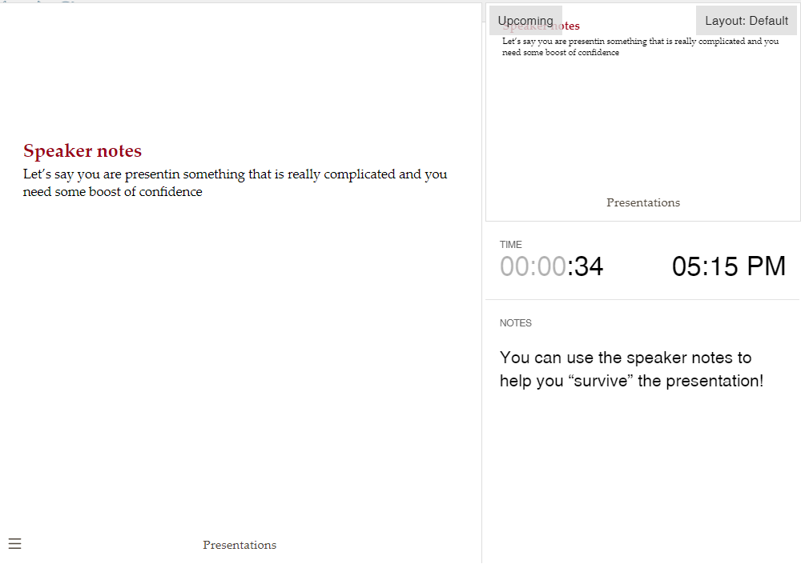

```{r}
#| include: false
#| label: setup

library(emoji)
library(ggplot2)
library(knitr)
library(kableExtra)
library(DT)
```


# YAML
 
## {.smaller} 

The format must be changed in `revealjs`

:::{.panel-tabset}

## YAML definition

```{markdown}
#| echo: true
title: "Presentation and Interactivity"
author:
  name: "Ottavia M. Epifania, Ph.D."
  email: ottavia.epifania@unitn.it
affiliation: "ARCA summer school"
format: 
  revealjs: 
    self-contained: true
    theme: [simple, custom.scss]
    logo: "img/peacock.png"
    footer: "Presentation"
    scrollable: true
    transition: none
    transition-speed: slow
    background-transition: fade
    slide-number:  c/t
    show-slide-number: all
[...]
```

## Arguments


| Option | Value | Description |
|--------|-------|-------------|
| `self-contained` | `true` | Embeds all dependencies (CSS, JS, images) into a single HTML file |
| `theme` | `[simple, custom.scss]` | Base theme plus custom SCSS styling |
| `logo` | `img/peacock.png` | Logo displayed in the presentation header/interface |
| `footer` | `"Presentation"` | Footer text shown on each slide |
| `scrollable` | `true` | Allows scrolling inside slides when content overflows |
| `transition` | `none` | Disables slide transition animations |
| `transition-speed` | `slow` | Controls transition speed (default, fast, slow) |
| `background-transition` | `fade` | Controls background transition effect between slides |
| `slide-number` | `c/t`, `c`, `true`, `false`, `h/v` | Controls slide numbering format: current/total (c/t), current only (c), hierarchical (h/v), enabled (true), or disabled (false) |
| `show-slide-number` | `all`, `speaker`, `print`, `false` | Controls where slide numbers appear: all slides, speaker view only, print/PDF only, or disabled |
:::

# Sections and slides 

## 


Create a Section (Header 1 `#`):

```{markdown}
#| echo: true
# Introduction
```


Create a Slide (Header 2 `##`): 

```{markdown}
#| echo: true
## This is a slide 

Here I write something concerning my topic
```

## 

::: {.incremental}

- What does *incremental* means?

- It means each element of a list is shown incrementally instead of showing all text from the beginning 

- Here's a new line! Shown incrementally 

:::
. . . 

YAML: 

```{markdown}
#| echo: true
#| codcode-line-numbers: "|3-5|"
title: "03-Presentations"
author: "Ottavia M. Epifania"
format:
  revealjs:
    incremental: true   
```

. . . 

::: {.callout-warning}

All contents in all slides are displayed incrementally! 
:::

## Control incremental contents

:::{.panel-tabset}

## Prevent increment

When: 

```{markdown}
#| echo: true
#| code-code-line-numbers: "|3|"
format:
  revealjs:
    incremental: true    
```


This prevents incremental lists: 


```{markdown}
#| echo: true
::: {.nonincremental}

- I'm a list

- But I'm not incremental 

- Even though I'm supposed to be 

:::
```


## Force increment


When (default): 

```{markdown}
#| echo: true
#| code-code-line-numbers: "|3|"
format:
  revealjs:
    incremental: false  
```

This allows for incremental lists: 


```{markdown}
#| echo: true
::: {.incremental}

- I'm a list

- and I'm incremental! 

- Even though I ain't supposed to be 

:::
```


:::

## Simple pause


You can force incremental contents 

. . . 

By pausing the contents

. . . 

This is how you do it: 

```{markdown}
#| echo: true 

You can force incremental contents 

. . . 

By pausing the contents

. . . 

This is how you do it: 
```


Create a Slide (Header 2 `##`): 

```{markdown}
#| echo: true
## This is a slide 

Here I write something concerning my topic
```

## Define slide-specific behavior


To delete the footer

```{markdown}
#| echo: true

## My slide with no footer {footer="false"}
```

To make the content scrollable


```{markdown}
#| echo: true

## My specific scrollable slide {.scrollable}
```


To make the content smaller


```{markdown}
#| echo: true

## The text in this slide is smaller {.smaller}
```

To combine them together


```{markdown}
#| echo: true

## Together {.smaller footer="false"}
```

# Themes

## Available themes 

A lot of [predefined themes](https://quarto.org/docs/presentations/revealjs/themes.html)! 

. . . 


:::: {.columns}

::: {.column width=50%}
```{markdown}
#| echo: true
#| code-line-numbers: "|6|"
---
title: "My presentation"
author: "Ted Bundy"
format:
  revealjs: 
    theme: dark
---
```


:::


::: {.column width=25%}

beige

blood

dark

default

dracula

league

moon

beige

blood

dark

:::

::: {.column width=25%}


**default**

dracula

league

moon

night

serif

simple

sky

solarized


:::


::::


# Figures


## Absolute positions

{.absolute top=200 left=0 width="350" height="300"}

{.absolute top=5 right=25 width="450" height="250"}

{.absolute bottom=0 right=100 width="500" height="400"}

## Stack content

:::{.r-stack}
{.fragment width="350" height="300"}

{.fragment width="450" height="250"}

{.fragment width="500" height="400"}

:::

## Stack content: Code

```{markdown}
#| echo: true
#| eval: false

:::{.r-stack}
{.fragment width="350" height="300"}

{.fragment width="450" height="250"}

{.fragment width="500" height="400"}

:::

```


## Pro Stacking


:::{.r-stack}
::: {.fragment}
{width="350" height="300"}
:::

::: {.fragment .fade-in-then-out}
{width="450" height="250"}
:::


::: {.fragment .fade-out}
{width="350" height="300"}
:::
:::


## Pro stacking: Code I

```{markdown}
#| echo: true
#| eval: false 

:::{.r-stack}
::: {.fragment}
{width="350" height="300"}
:::

::: {.fragment .fade-in-then-out}
{width="450" height="250"}
:::


::: {.fragment .fade-out}
{width="350" height="300"}
:::
:::

```


## Other options

::: {.fragment .highlight-red}
This text will turn red
:::


::: {.fragment .fade-up}
{width="500" height="400"}
:::


## Pro stacking: Code II

```{markdown}
#| echo: true
#| eval: false 

::: {.fragment .highlight-red}
This text will turn red
:::


::: {.fragment .fade-up}
{width="500" height="400"}
:::
```


# Notes 

## Speaker notes 


Let's say you are presenting something that is really complicated and you need some boost of confidence

::: {.notes}
You can use the speaker notes to help you "survive" the presentation!
:::


## View the speaker notes

When you are in presentation mode, just press `S`: 

:::{.panel-tabset}

## View 

```{r}
#| fig-align: center
#| out-width: 100%

```


## Write


```{markdown}
#| echo: true

Let's say you are presenting something that is really complicated and you need some boost of confidence

::: {.notes}
You can use the speaker notes to help you "survive" the presentation!
:::

```

:::

# Code 


## Code highlight 

```{r}
#| echo: fenced
#| fig-align: center
#| code-line-numbers: "|3|6-8|6,7|"

mtcars %>%                               
  ggplot( aes(mpg, hp, size = gear)) +   
  geom_point() +                             
  geom_smooth(method = "lm")             

```

## {auto-animate="true"}

```{r}
#| echo: true
# Create a scatterplot with a smoothing function
ggplot(mtcars,
       aes(mpg, hp, size = gear)) +
  geom_point() 
```


## {auto-animate="true"}

```{r}
#| echo: true
# Create a scatterplot with a smoothing function
ggplot(mtcars,
       aes(mpg, hp, size = gear)) +
  geom_point() + 
  geom_smooth()
```

## Code animation

````
## {auto-animate="true"}

```{r}`r ''`
#| echo: true
# Create a scatterplot with a smoothing function
ggplot(mtcars,
       aes(mpg, hp, size = gear)) +
  geom_point() 
```

## {auto-animate="true"}

```{r}`r ''`
#| echo: true
# Create a scatterplot with a smoothing function
ggplot(mtcars,
       aes(mpg, hp, size = gear)) +
  geom_point() + 
  geom_smooth()
```

````


## Output location: Delayed `fragment`

```{r}
#| echo: fenced
#| fig-align: center
#| output-location: fragment
#| code-line-numbers: "|3|"

mtcars %>%                               
  ggplot( aes(mpg, hp, size = gear)) +   
  geom_point() +                             
  geom_smooth(method = "lm")        
```

## Output location: Dealyed along the code `column-fragment`

```{r}
#| echo: fenced
#| fig-align: center
#| output-location: column-fragment
#| code-line-numbers: "|3|"

mtcars %>%                               
  ggplot( aes(mpg, hp, size = gear)) +   
  geom_point() +                             
  geom_smooth(method = "lm")        
```

## Output location: Next slide `slide`

```{r}
#| echo: fenced
#| fig-align: center
#| output-location: slide
#| code-line-numbers: "|3|"

mtcars %>%                               
  ggplot( aes(mpg, hp, size = gear)) +   
  geom_point() +                             
  geom_smooth(method = "lm")        
```


## Output location: Along the code `column`

```{r}
#| echo: fenced
#| fig-align: center
#| output-location: column
#| code-line-numbers: "|3|"

mtcars %>%                               
  ggplot( aes(mpg, hp, size = gear)) +   
  geom_point() +                             
  geom_smooth(method = "lm")        
```


