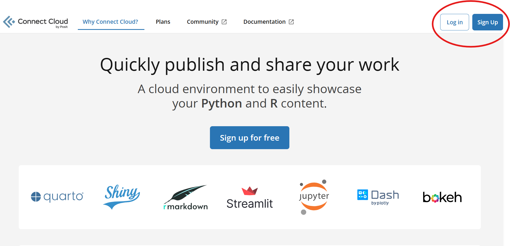
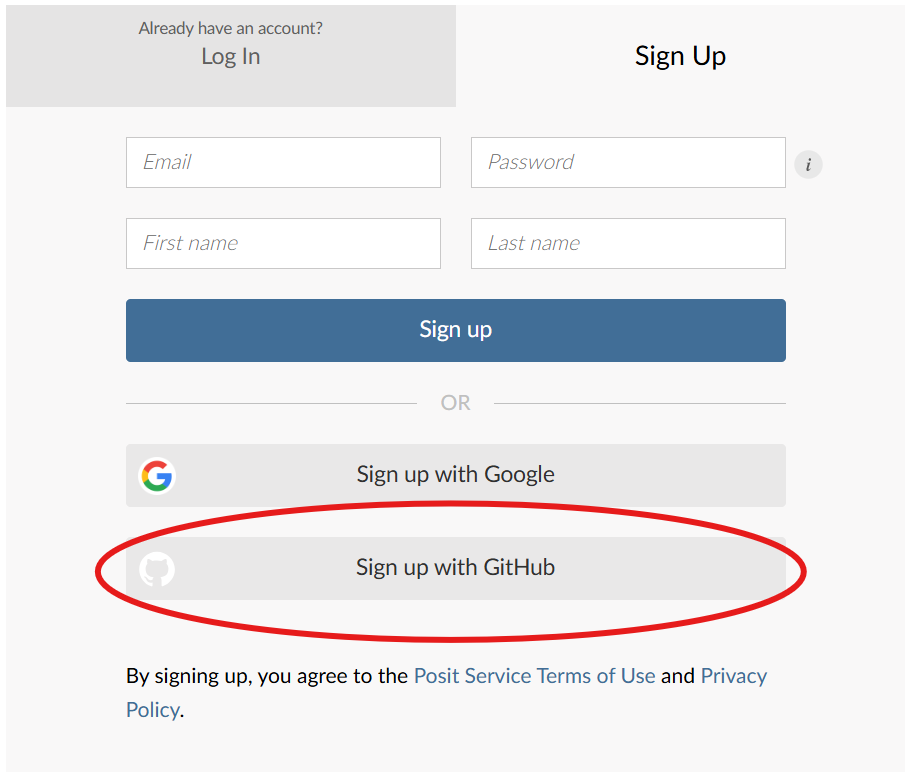
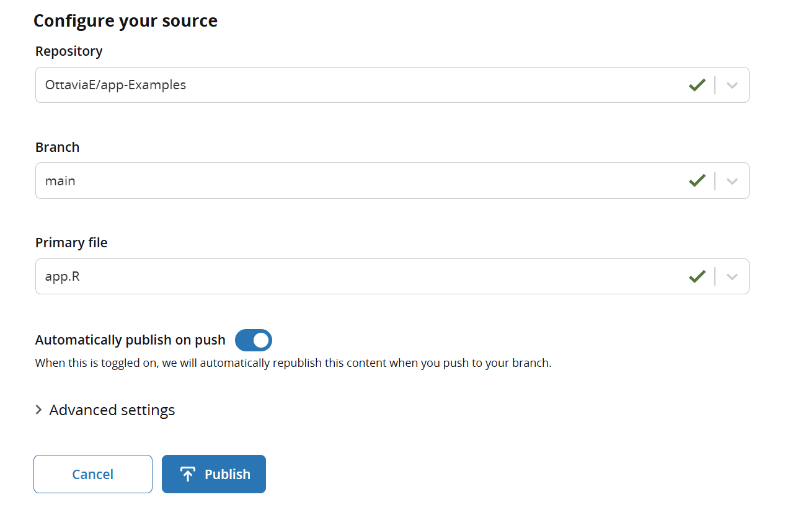

# What is needed

1. An online server hosting the application (@sec-server) (which is connected to GitHub)
2. The local version on your computer (@sec-app)
3. The connection between the app and the online server (@sec-connect)
4. The deployment (@sec-deploy)

## Shiny server {#sec-server}

Many servers exist, [this article](https://shiny.posit.co/r/articles/share/shiny-server/) provides an overview on the available ones, although a subscription is required for pro features.

You can set a server from scratch (choose your own adventure). Here's an option with [Digital Ocean](https://deanattali.com/2015/05/09/setup-rstudio-shiny-server-digital-ocean/) provided by Dean Attali. This option requires quite advanced porgramming skills, although the guide provided by Dean Attali is very basic and easy-to-use.

[shinyapps.io](https://www.shinyapps.io/) is the "official" server for shiny apps. The free licence version allows for hosting 5 apps at the time.


:::{.callout-warning}
## Connect cloud

At the end of 2026, shinyapps.io will be replaced by [Connect Cloud](https://connect.posit.cloud/)

:::

### Connect Cloud 


```{r}
#| echo: false
#| fig-align: center
#| fig-cap: "Connect cloud landing page and account creation"

```

The account on Connect Cloud can be connected to an already existent account, such as a Google Account. The best option is to link Connect Cloud to your GitHub account: 

```{r}
#| echo: false
#| fig-align: center
#| fig-cap: "Link Connect Cloud to your GitHub account"

```

Follow the instructions and then choose an account name for posit.


## Local app {#sec-app}

The app must be stored in an R file with clearly defined `ui` and `server`. 

The R file must me named `app.R`. 

Once the app is ready for deployment, commit and push as usual.

The file must be within an [R project](https://arca-dpss.github.io/shine-with-quarto/R-Project.html), which is set to be a [GitHub](https://arca-dpss.github.io/shine-with-quarto/git-hub.html) repository.

## `rsconnect` {#sec-connect}

The `rconnect` package is necessary to link the local app, the GitHub repository, and the Connect Cloud. 

Connect Cloud is not R -- as such, it needs external files describing the packages/dependencies that are employed and needed for the app deployment.

First, the package needs to be installed (@lst-install).

```{r}
#| eval: false
#| lst-label: lst-install
#| lst-cap: Install the package
install.packages("rsconnect")
```

Then, within the R-project hosting the `app.R` file, run the code in @lst-manifest

```{r}
#| eval: false
#| lst-label: lst-manifest
#| lst-cap: Write the manifesto 

rsconnect::writeManifest()
```

The file `manifest.json` is apperead within the R project, making the app deployment possible. 

For the deployment, the folder of the project should have the following structure: 

```text
app-Examples/
├── .gitattributes
├── .gitignore
├── app-Examples.Rproj
├── app.R
└── manifest.json
```


## Deploy {#sec-deploy}

Everything is ready for the actual deployment of the app from Connect Cloud. 

From the `Home` of your profile, search for the `Publish` button. 

Select the repository, the folder, and the specific file of the app (@fig-pubapp)

```{r}
#| echo: false
#| fig-cap: "Deploy app and publish it"
#| label: fig-pubapp


```


